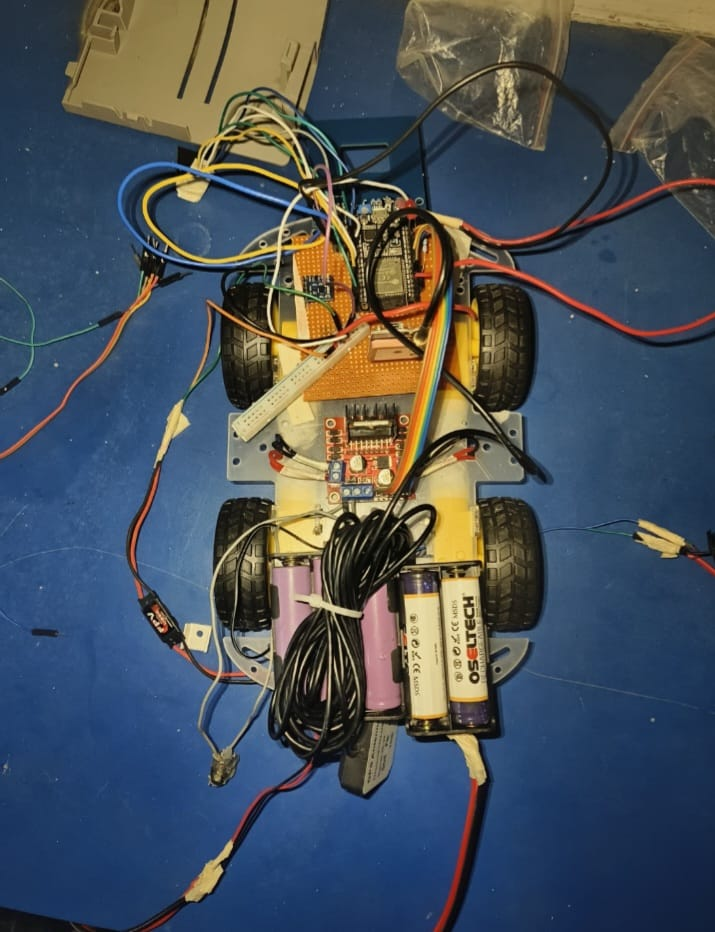
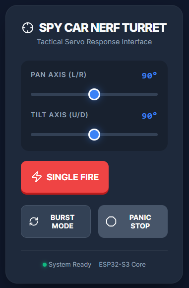
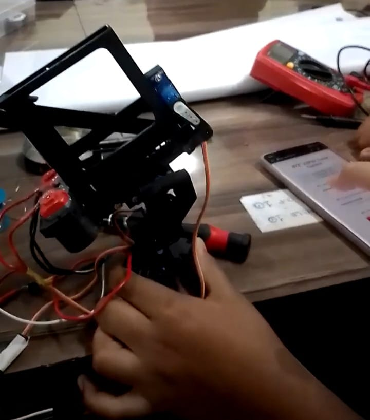

# SPY-CAR-MPB
  

A compact, modular spy car / surveillance robot platform integrating live camera streaming, GPS geolocation, AI-based object detection, and remote control for rapid prototyping and field testing.


<table>
  <tr>

    <!-- IMAGE -->
    <td width="46%" align="center" valign="top">
      
      <br/>
      <sub><b>SPY-CAR Prototype Chassis</b></sub>
    </td>

    <!-- TEXT -->
    <td width="54%" valign="top">

<h2>🚗 SPY-CAR-MPB</h2>

<p>
A compact, modular <b>spy car / surveillance robot platform</b> built for rapid prototyping
and real-world field deployment. The system integrates live video streaming,
GPS geolocation, AI-based object detection, and dual remote control modes.
</p>

<h3>🔹 Core Capabilities</h3>

<ul>
  <li>🎥 Real-time camera streaming with AI detection</li>
  <li>📍 GPS-tagged captures and telemetry logging</li>
  <li>🌐 Web-based control + NRF hardware remote</li>
  <li>🧩 Modular Arduino + Python hybrid architecture</li>
</ul>

    </td>

  </tr>
</table>

---

## Table of Contents
- [Overview](#overview)
- [Key Features](#key-features)
- [Hardware Components](#hardware-components)
- [Software & Technologies Used](#software--technologies-used)
- [System Architecture](#system-architecture)
- [Installation / Setup Guide](#installation--setup-guide)
- [Usage Instructions](#usage-instructions)
- [Controls](#controls)
- [Images & Demonstration](#images--demonstration)
- [Project Structure](#project-structure)
- [Future Improvements](#future-improvements)
- [Contributing](#contributing)
- [License](#license)
- [Author / Credits](#author--credits)

---

## Overview
`SPY-CAR-MPB` is an open, extensible surveillance robotics project designed for experimentation and field testing. It combines Arduino-driven motor/servo control, a camera streaming service, GPS-tagged captures, and AI-assisted detection pipelines to create a flexible mobile observation platform.

## Key Features
- Real-time camera streaming via a lightweight Python web service.
- AI-assisted object detection and alert overlays (e.g., weapon detection proofs-of-concept).
- Pan/tilt turret with servo control (web UI and Arduino sketches).
- Dual control modes: browser-based control panel and NRF24L01 remote control sketch.
- GPS geolocation for coordinate-tagged captures and telemetry logging.
- Capture gallery with upload and review UI.
- Modular codebase: separate Arduino sketches and Python service scripts for rapid iteration.

## Hardware Components
- Chassis with DC motors and motor driver (H-bridge).
- Arduino (Uno/Nano/compatible) for motor and servo control.
- Camera: USB webcam or Raspberry Pi camera for live capture.
- Pan/Tilt servos for turret movement.
- NRF24L01 wireless module for remote control (optional).
- GPS module (e.g., NEO-6M) for geolocation metadata.
- Power: LiPo battery pack or equivalent with voltage regulation.

## Software & Technologies Used
- Python 3.x — server, capture, and detection scripts.
- Flask (or similar) — web UI and API endpoints.
- OpenCV — capture, preprocessing, and detection helpers.
- TensorFlow / PyTorch / OpenCV DNN — optional detection backends (modular).
- Arduino sketches (`.ino`) — motor & servo control, NRF handling.
- Standard web stack (HTML/CSS/JS) for the control UI.

## System Architecture
- Embedded Layer: `bot_with_web_control.ino`, `bot_with_nrf_remote.ino`, `nerf_turret.ino` (low-level control).
- Device Layer: Camera and GPS provide sensory input.
- Service Layer: Python scripts (`app.py`, `cam.py`, `upload.py`) handle streaming, capture, uploads, and AI pipeline.
- UI Layer: Browser-based control panel and capture gallery.

Simplified flow:

```
[Browser UI] <--> [Python Server: app.py / cam.py / upload.py] <--> [Camera] -> [OpenCV / Detection]
																				 |
																				 +--> [Arduino (USB/Serial)] <--> [Motors / Servos / NRF]
																				 |
																				 +--> [GPS Module] -> [Logged Coordinates]
```

---

## Installation / Setup Guide

Prerequisites
- Python 3.8+ installed
- Arduino IDE for uploading sketches
- USB connection to Arduino (or NRF link for wireless remote)
- Webcam or Pi Camera accessible from the host machine

1. Clone repository

```bash
git clone https://github.com/your-username/SPY-CAR-MPB.git
cd SPY-CAR-MPB
```

2. Create and activate a Python virtual environment

```bash
python -m venv .venv
.venv\Scripts\activate    # Windows
source .venv/bin/activate  # macOS / Linux
```

3. Install Python dependencies

```bash
pip install -r Upload/requirements.txt
```

4. Upload Arduino sketches
- Open `bot_with_web_control.ino`, `bot_with_nrf_remote.ino`, or `nerf_turret.ino` in the Arduino IDE and upload to your board.

5. Connect hardware
- Power motors and servos from a suitable battery.
- Connect GPS and camera modules.
- Verify serial connectivity with Arduino.

---

## Usage Instructions

Start the Python server (example):

```bash
python app.py
# or
python cam.py
```

Open the control UI in a browser:
- http://localhost:5000/ — main control UI and live stream (default)
- `templates/live_stream.html` — direct stream view
- `templates/captures.html` — gallery of saved captures

To capture frames with GPS metadata, use the web UI `Capture` button. Captures are stored in `static/captures/` or `GPS/static/captures/` depending on configuration.

AI Detection
- Place model files where your detection script expects them and configure the script to load the model. The detection step integrates into the camera processing pipeline.

---

## Controls
- Web UI: on-screen joystick, arrow controls, or keyboard mapping (W/A/S/D or arrow keys) for movement.
- Turret: sliders or buttons in the UI for pan/tilt and capture.
- NRF Remote: use `bot_with_nrf_remote.ino` with a second NRF-equipped Arduino transmitter.
- Serial: test commands can be sent over Serial to exercise motors/servos during debugging (refer to each `.ino` file comments for command format).

Example mapping:
- `W` / Up — forward
- `S` / Down — reverse
- `A` / Left — left
- `D` / Right — right
- `Capture` — save current frame + GPS

---

## Images & Demonstration
Below are representative images from the `images/` folder presented in a centered gallery with modest sizes for readability.

<p align="center">
	
	
	
</p>
<p align="center"><em>Turret web UI — Turret model — Chassis prototype</em></p>

<p align="center">
	
	
	
</p>
<p align="center"><em>AI overlay — Field Demo A — Field Demo B</em></p>

<p align="center">
	
</p>
<p align="center"><em>Operator and vehicle during a test run.</em></p>
---

## Project Structure
Concise tree of the repository (key files and directories):

```
SPY-CAR-MPB/
├─ app.py
├─ cam.py
├─ upload.py
├─ bot_with_nrf_remote.ino
├─ bot_with_web_control.ino
├─ nerf_turret.ino
├─ README.md
├─ images/
│  ├─ turret_web.png
│  ├─ turretmodel.jpeg
│  ├─ Spycarbasicmodel.jpeg
│  ├─ AI weapon ditection.jpeg
│  └─ spycarwebcontrolapp/
│     ├─ WhatsApp Image 2026-02-20 at 5.20.24 PM.jpeg
│     ├─ WhatsApp Image 2026-02-20 at 5.20.25 PM.jpeg
│     └─ WhatsApp Image 2026-02-20 at 5.20.25 PM (1).jpeg
├─ static/
│  └─ captures/
├─ GPS/
│  ├─ app.py
│  └─ templates/
└─ Upload/
	 ├─ requirements.txt
	 └─ upload.py
```

---

## Future Improvements
- Integrate TensorFlow Lite or an optimized on-device model for low-latency detection.
- Add secure authentication, HTTPS, and optional VPN/SSH tunnel support for remote operation.
- Stream over WebRTC for reduced latency and robust NAT traversal.
- Add ROS compatibility and simulation support for autonomous behaviors.
- Battery monitoring and telemetry reporting for extended field operations.

## Contributing
Contributions are welcome. Recommended workflow:
- Fork the repository
- Create a feature branch: `git checkout -b feat/your-feature`
- Commit changes with clear messages
- Open a pull request describing your changes and tests

Please keep changes focused, include documentation for new features, and run local tests where applicable.

---

## License
This project is released under the MIT License.

Full text should be placed in a `LICENSE` file in the repository root. Permission is granted, free of charge, to use, copy, modify, merge, publish, distribute, sublicense, and/or sell copies of this software, subject to the MIT license terms.

## Author / Credits
- Project: `SPY-CAR-MPB`
- Maintainer: Project author and contributors
- Acknowledgements: OpenCV, Arduino community libraries, and open-source detection model authors.

---

If you'd like, I can also create a `LICENSE` file, add CI checks, or open a PR with this README.

